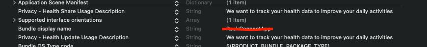

# RookSDK

If you’re building a health or fitness application of any kind, you likely know of the power of health user data. You will benefit when integrating it with your application no matter what your use case is: mindfulness or wellness, digital health, or remote care.

Apple Health does not have an API. As no data is stored in the cloud, you need to retrieve it locally from your user's devices. This can be done by implementing Apple HealthKit and all its data retrieval methods into your iOS

RookSDK allows developers to ask their users to access and share their health data through Apple HealthKit

Rook SDK for iOS enables fetch health data from apple health and synchronize it with rook server. It also enables to register a new user and store it locally.

The SDK provides access to apple health data, however, is enabled only after the user's explicit consent. The user can select detailed data sharing settings including witch data type will be read.

## Demo app

To help your implementation here is a demo app that shows you how to configure and use the sdk: https://github.com/RookeriesDevelopment/rook_demo_app_ios_rook_sdk


## Features

The features listed bellow are available to fetch and synchronize:

- Sleep summaries
- Physical summaries
- Body summaries
- Heart rate events
- Oxygenation events
- Activity events
- Temperature Events
- Blood Glucose Events
- Blood Pressure Events
- Time zone of the device
- Variable extraction
- Background active extraction

## Integrating the iOS framework
----

## Installation

**The SDK requires Xcode 14.0.1 or higher. To run your app using the Rook SDK on a connected device with iOS 16.2 or later you need Xcode 14.2 or higher.**

To add a package dependency to your Xcode project, select File > Swift Packages > Add Package Dependency and enter the repository URL [rook SDK](https://github.com/RookeriesDevelopment/rook-ios-sdk)

## Configuration

To configure Rook SDK, you need to follow this steps:

1. Import the apple health sdk

```swift
import RookSDK
```

2. Add your credentials. 
 - This method should be called at the beginning of your app's launch process.

```swift
func application(_ application: UIApplication
                 didFinishLaunchingWithOptions launchOptions: [UIApplication.LaunchOptionsKey : Any]? = nil) -> Bool {
    
    RookConnectConfigurationManager.shared.setConfiguration(
      clientUUID: "YOUR-CLIENT-UUID",
      secretKey: "YOUR-SECRET-KEY")
      
    RookConnectConfigurationManager.shared.setEnvironment(.sandbox)
    
    RookConnectConfigurationManager.shared.initRook()
    return true
}
```

3. Add the HealthKit framework to your Xcode project:

- Open your project in Xcode.
- Click on your project file in the Project Navigator.
- Select your target and then click on the "Build Phases" tab.
- Click on the "+" button under the "Link Binary With Libraries" section and select "HealthKit.framework" from the list.


4. Then declare the privacy permissions used by this SDK. You will need to include the NSHealthShareUsageDescription and NSHealthUpdateUsageDescription keys in your app's Info.plist file. These keys provide a description of why your app needs to access HealthKit data and will be displayed to the user in the permission request dialog.

```text
<key>NSHealthShareUsageDescription</key>
<string>This app requires access to your health and fitness data in order to track your workouts and activity levels.</string>
<key>NSHealthUpdateUsageDescription</key>
<string>This app requires permission to write health data to HealthKit.</string>
```



### Configuration

RookConnectConfigurationManager Use this class to configure and init the sdk.
This class conforms the singleton pattern, to access this class use the shared property.

| Method | Description |
| ----- | ----- |
| `func setConfiguration(clientUUID: String, secretKey: String)` | Sets the configuration of the sdk. |
| `func setEnvironment(_ environment: RookEnvironment)`| Configures the rook sdk environment. |
| `func initRook()` | Initializes the rook sdk |
| `func updateUserId(_ id: String, completion: @escaping (Result<Bool, Error>) -> Void)` | It will try to register the user in the rook server and it will be stored, if the registration was successful, after that the sdk upload the current time zone of the device. |
| `func clearUser(completion: @escaping (Result<Bool, Error>) -> Void)` | Deletes the user stored locally. |
| `func removeUserFromRook(completion: @escaping (Result<Bool, Error>) -> Void)` |  Removes the authorization od the user to upload data from apple health and deletes the user id stored locally. |
| `func syncUserTimeZone(completion: @escaping (Result<Bool, Error>) -> Void)`| Uploads the current time zone of the device a user has to added before use this method. |

### Get user authorization

Before you can retrieve any data, your app needs to be authorized to access Apple Health data by your users. To get authorization, use the authorize method and the corresponding dialogue will be shown on top of your app.


The sdk provides `RookConnectPermissionsManager` class to request user's permission. It contains the methods described bellow:

| Method | Description |
| ----- | ----- |
|  + `requestAllPermissions(completion: @escaping (Result<Bool, Error>) -> Void)`| Sends a request for all the health permissions and displays a view to grand access |
| + `requestSleepPermissions(completion: @escaping (Result<Bool, Error>) -> Void)` | Sends a request for the sleep data types permissions and displays a view to grand access. |
| + `requestUserInfoPermissions(completion: @escaping (Result<Bool, Error>) -> Void)` | Sends a request for the user information permissions. |
| + `requestPhysicalPermissions(completion: @escaping (Result<Bool, Error>) -> Void)` | Sends a request for the physical data types permissions and displays a view to grand access |
| + `requestBodyPermissions(completion: @escaping (Result<Bool, Error>) -> Void)` | Sends a request for the body data type permissions and displays a view to grand access. |

**Note: The callback of each method will return a boolean true if the permission window was successfully presented or false and an optional error if the window was not presented properly. This value does not indicate whether the user actually granted permission. Please keep in mind, that Apple Health does not allow to check the status of permission for types which were requested to be read. If the user does not allow data types reading by mistake or on purpose, it simply appears as if there is no data of the requested type in the Heathkit store. Any further change must be performed by the user through the Apple Health application.**

### User

Before synchronize summaries or events a user have to be added, otherwise the sdk will return an error.

The class `RookConnectConfigurationManager` contains two methods related to the user access.

| Method | Description |
| ----- | ----- |
| `func updateUserId(_ id: String, completion: @escaping (Result<Bool, Error>) -> Void)` | It will try to register the user in the rook server and it will be stored, if the registration was successful, after that the sdk upload the current time zone of the device. |
| `func clearUser(completion: @escaping (Result<Bool, Error>) -> Void)` | Deletes the user stored locally. |
| `public func syncUserTimeZone(completion: @escaping (Result<Bool, Error>) -> Void)` | Uploads the current time zone of the device a user has to added before use this method. |

# Manual Sync Data

---

### RookSummaryManger

This class contains the methods to synchronize summaries of the user

| Method | Description |
| ----- | ----- |
| `func syncYesterdaySummaries(completion: @escaping () -> Void)` | Synchronizes the sleep, physical and body summaries of the day before of the device's current date. |
| `func syncSleepSummary(form date: Date, completion: @escaping (Result<Bool, Error>) -> Void)` | Synchronizes the sleep summary from the given day date. |
| `func syncPhysicalSummary(form date: Date, completion: @escaping (Result<Bool, Error>) -> Void)` | Synchronizes the physical summary from the given day date. |
| `func syncBodySummary(from date: Date, completion: @escaping (Result<Bool, Error>) -> Void)` | Synchronizes the body summary from the given day date. |

### RookEventsManager

| Method | Description |
| ----- | ----- |
| `func syncYesterdayEvents(completion: @escaping () -> Void)` | Synchronized all the events of the day before of the device's current date |
| `func syncBodyHeartRateEvent(date: Date, completion: @escaping (Result<Bool, Error>) -> Void)` | Synchronized all the body heart rate events from the given day date. |
| `func syncPhysicalHeartRateEvent(date: Date, completion: @escaping (Result<Bool, Error>) -> Void)` | Synchronized all the physical heart rate events from the given day date. |
| `func syncBodyOxygenationEvent(date: Date, completion: @escaping (Result<Bool, Error>) -> Void)` | Synchronized all the body oxygenation events from the given day date. |
| `func syncPhysicalOxygenationEvent(date: Date, completion: @escaping (Result<Bool, Error>) -> Void)` | Synchronized all the physical oxygenation events from the given day date. |
| `func syncTrainingEvent(date: Date, completion: @escaping (Result<Bool, Error>) -> Void)` | Synchronized all the trainings events from the given day date. |
| `func syncTemperatureEvents(date: Date, completion: @escaping (Result<Bool, Error>) -> Void)` | Synchronized all the temperature events from the given day date. |
| `func syncBloodPressureEvents(date: Date, completion: @escaping (Result<Bool, Error>) -> Void)` | Synchronized all the blood pressure events from the given day date. |
| `func syncBloodGlucoseEvents(date: Date, completion: @escaping (Result<Bool, Error>) -> Void)` | Synchronized all the blood glucose events from the given day date. |

**Note: We highly advise to not retrieve more than 14 days of EPOCH data and 30 days of Daily data for more than one data type. Due to the expected data, the data retrieval will require extensive resources and will effect the user experience.**

### Variable extraction

`RookVariableExtractionManager` allows to extract the current value of the following health data. to use this class is necessary to import `import RookAppleHealth` in your file.

- step count
- active calories burner

| Method | Description |
| ----- | ----- |
| `func getTodaySteps(completion: @escaping (Result<Int, Error>) -> Void)` | Returns the step count of the current day. |
| `func getTodayActiveCaloriesBurned(completion: @escaping (Result<Int, Error>) -> Void)` | Returns the active calories burned of the current day. |

### Background active extraction

`RookBackGroundExtraction` allows to read health data while your app is in background. the health data available to read in background is:

- step count.
- active calories burned.

**Note: Please note that for security, iOS devices encrypt the HealthKit storage when users lock their devices. As a result, apps may not be able to read data from Apple Health when it runs in the background. Please refer to the official documentation for more information.**

To configure background delivery you need to follow the steps bellow:

- Add health kit to your project and enable background delivery.
- Add Background modes and enable Background fetch.


- In the app delegate of your app add the following method in didFinishLaunchingWithOptions function.

#### Example

``` swift

import RookAppleHealth

class AppDelegate: NSObject, UIApplicationDelegate {
  
  func application(_ application: UIApplication,
                   didFinishLaunchingWithOptions launchOptions: [UIApplication.LaunchOptionsKey : Any]? = nil) -> Bool {
                    RookBackGroundExtraction.shared.setBackGroundListeners()
                   }
```

- it is recommended to add the callback that notifies when new information is available.

#### Example

``` swift

import RookAppleHealth

class AppDelegate: NSObject, UIApplicationDelegate {
  
  func application(_ application: UIApplication,
                   didFinishLaunchingWithOptions launchOptions: [UIApplication.LaunchOptionsKey : Any]? = nil) -> Bool {
                    RookBackGroundExtraction.shared.setBackGroundListeners()

                    RookBackGroundExtraction.shared.handleCaloriesUpdate = { [weak self] caloriesBurned in
                    // Do something whit the new data
                    }

                    RookBackGroundExtraction.shared.handleStepsUpdate = { [weak self] steps in
                    // Do something with the new data
                    }
                   }
```

- To enable or disable the step background read and calories the following methods are available.

| Method | Description |
| ----- | ----- |
| `func enableBackGroundForSteps()` | Enables the step background read. |
| `func enableBackGroundForCalories()` | Enables the calories background read. |
| `func disableBackGroundForSteps(completion: @escaping (Result<Bool, Error>) -> Void)` | Disables the step background read. |
| `func disableBackGroundForCalories(completion: @escaping (Result<Bool, Error>) -> Void)` | Disables the calories background read. |
| `func isCaloriesBackgroundEnable(completion: @escaping (Bool) -> Void)` | Returns in the completion block a boolean value indicating if the active calories extraction is enable. |
| `func isStepsBackgroundEnable(completion: @escaping (Bool) -> Void)` | Returns in the completion block a boolean value indicating if the steps extraction is enable. |
| `var handleStepsUpdate: ((Int) -> Void)?` | Closure that handles the today step count update |
| `var handleCaloriesUpdate: ((Int) -> Void)?` | Closure that handles the today active calories count update. |

